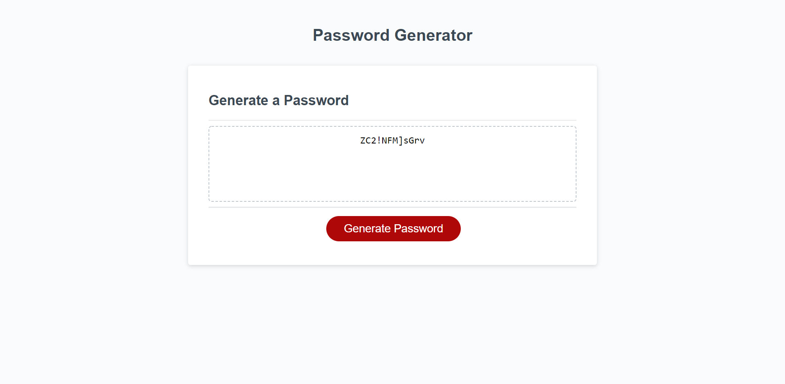

# random-password-generator

## Description
The purpose of this application is to generate a random password based on certain criterias.

## Table of Contents

* [Installation](#installation)
* [Usage](#usage)
* [Credits](#credits)
* [License](#license)

## Installation

The project is viewable at the project's github pages.

URL of deployed application: https://armcuellar.github.io/random-password-generator/

## Usage
This application generates a password based on criterias you want to inlcude.

The criterias available to select are:
* Length of password
* Whether to include numeric characters
* Whether to include uppercase characters
* Whether to include lowercase characters
* Whether to include special characters

The length of password criteria includes validation to prevent any characters other than numeric to be entered and have a length of between 8 through 128.

## Credits

[Armando Cuellar](https://github.com/armcuellar) 

Reference websites:

`NaN`: https://www.w3schools.com/jsref/jsref_isnan.asp

`charAt` https://developer.mozilla.org/en-US/docs/Web/JavaScript/Reference/Global_Objects/String/charAt

## License

Licencsed under [MIT License](LICENSE)

